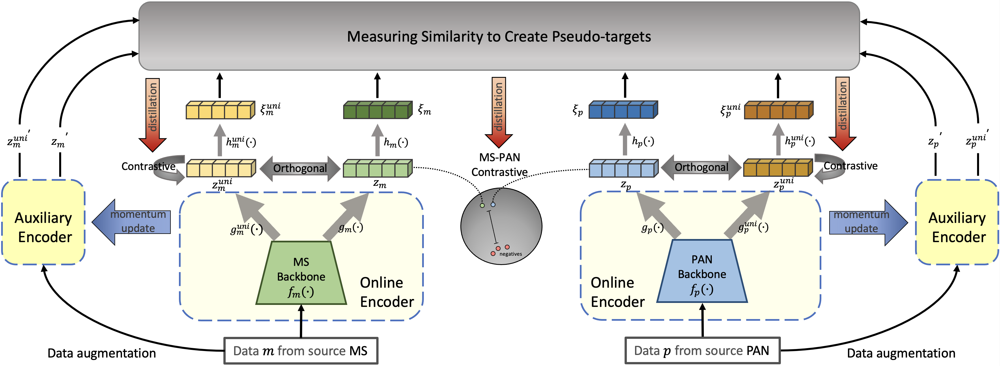

# PyTorch-CrossCLMP
### PyTorch implementation of "Few-Shot MS and PAN Joint Classification with Improved Cross-Source Contrastive Learning". 

DOI: 10.1109/TGRS.2024.3416298



## Installation

Clone the repository and run
```
$ conda env create --name CrossCLMP --file env.yml
$ conda activate CrossCLMP
$ python main.py
```

## Config

Before running PyTorch CrossCLMP, make sure you choose the correct running configurations on the config.yaml file.

```yaml
network:
  # configurations for the projection and prediction heads
  projection_head: 
    mlp_hidden_size: 512 
    projection_size: 128 

trainer:
  batch_size: 128
  m: 0.996 # momentum update
  checkpoint_interval: 5000
  max_epochs: 500 
  num_workers: 4 # number of worker for the data loader
  loss: 'dcl'

optimizer:
  params:
    lr: 0.03
    momentum: 0.9
    weight_decay: 0.0004
```

## Feature Evaluation

We measure the quality of the learned representations by linear separability.

```
$ python evaluation.py
```

